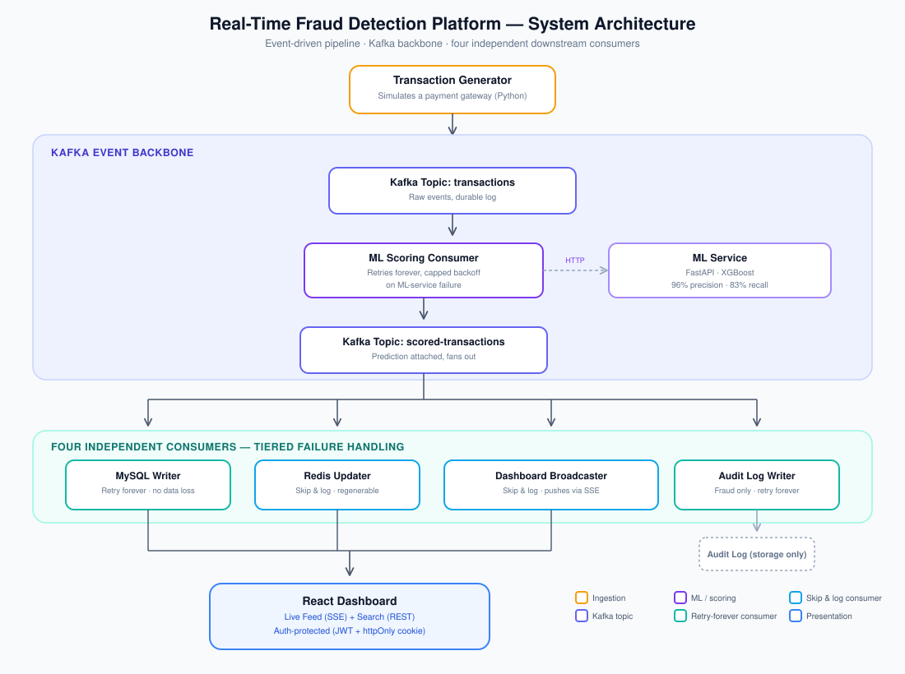

# Real-Time Credit Card Fraud Detection & Monitoring System


A simulation of how a payment company (Stripe/PayPal-style) monitors card transactions in real time: transactions stream in one at a time, an ML model scores each for fraud, every result is stored, and a live dashboard shows it to fraud analysts with no page refresh. There's no live transaction feed available for a demo project like this, so the system replays the [Kaggle Credit Card Fraud Detection dataset](https://www.kaggle.com/datasets/mlg-ulb/creditcardfraud) as if it were happening now, at roughly one transaction per second.

**Architecturally:** four independently deployable, containerized services — Generator, ML Service, Backend, and Dashboard — communicating over Kafka and HTTP. Within the Backend specifically, five Kafka consumers run as independent consumer groups with their own failure-handling policies, but as one deployment unit, not five separately-deployable services — a deliberate choice, not an oversight (see [Key Design Decisions](#key-design-decisions)).

---

## Contents

- [Highlights](#highlights)
- [Architecture](#architecture)
- [Tech Stack](#tech-stack)
- [Quickstart](#quickstart)
- [Viewing Logs](#viewing-logs)
- [API Reference](#api-reference)
- [Environment Variables](#environment-variables)
- [Key Design Decisions](#key-design-decisions)
- [Resetting to a Clean State](#resetting-to-a-clean-state)
- [Known Limitations](#known-limitations)
- [Project Structure](#project-structure)
- [Screenshots](#screenshots)

---

## Highlights

| | |
|---|---|
| 🎯 **96% precision / 83% recall** | XGBoost, benchmarked against Isolation Forest on a 0.17%-imbalanced dataset (0.88 vs. 0.28 AUPRC) |
| 🧩 **7 containerized services** | One `docker compose up`, healthcheck-gated startup ordering |
| 🔀 **5 independent Kafka consumers** | Tiered failure handling — retry-forever for durable records, skip-and-log for regenerable views |
| ⚡ **Live dashboard, zero polling** | Server-Sent Events with a snapshot-plus-live-delta reconnect strategy |
| 🔐 **JWT + httpOnly cookie auth** | Protecting the dashboard, REST API, and SSE stream alike |
| 🐛 **Real bugs, found and fixed** | A Kafka cold-start race, a hidden library retry loop, a duplicate-key idempotency gap — all diagnosed and resolved during development, not hidden |

## Architecture



The Generator replays the dataset onto a `transactions` topic. A scoring consumer reads it, calls the ML service, and republishes the result — original data plus the prediction — onto a second topic, `scored-transactions`. Four independent consumers read that second topic in parallel: one writes the permanent record to MySQL, one updates hot aggregate stats in Redis, one pushes live updates to connected dashboards over Server-Sent Events, and one writes a compliance-style audit record for every transaction flagged as fraud. The dashboard itself is two views: a live feed that updates in real time as new transactions arrive, and a separate search page for querying historical data on demand — both sitting behind authentication.

## Tech Stack

| Layer | Technology |
|---|---|
| Event backbone | Apache Kafka (KRaft mode) |
| Backend orchestration | Node.js, Express |
| ML serving | Python, FastAPI |
| Fraud model | XGBoost |
| System of record | MySQL, Prisma ORM |
| Hot aggregates / cache | Redis |
| Frontend | React, Server-Sent Events |
| Auth | JWT, httpOnly cookies |
| Deployment | Docker, Docker Compose |

## Quickstart

Requires [Docker](https://www.docker.com/) and Docker Compose (bundled with Docker Desktop).

```bash
git clone https://github.com/PaladuguGeetesh/Real-Time-Fraud-Detection-Platform.git
cd Real-Time-Fraud-Detection-Platform
docker compose up -d --build
```

That's the entire setup. A first cold start typically takes a couple of minutes — most of the time goes into pulling base images and installing dependencies (Kafka's image, npm/pip installs, the dashboard's production build). Every subsequent restart is much faster, since Docker caches those layers.

Once it's up:

- **Dashboard:** [http://localhost:5173](http://localhost:5173)
- **Backend health check:** [http://localhost:4000/api/health](http://localhost:4000/api/health) → `{"status":"ok"}`
- **ML service docs:** [http://localhost:8000/docs](http://localhost:8000/docs)

To watch it start up — confirm `kafka`, `mysql`, `redis`, and `ml-service` show `healthy` (they have healthchecks backing them), and `backend-service`, `generator-service`, and `dashboard-service` show `running` (no healthcheck configured for these — `running` is the expected, correct state for them):

```bash
docker compose ps
```

To stop everything (data persists — MySQL and Kafka both use named volumes):

```bash
docker compose stop
```

## Viewing Logs

Stream logs for the whole system, or one service at a time:

```bash
# Everything, interleaved
docker compose logs -f

# One specific service
docker compose logs -f backend-service
docker compose logs -f ml-service
docker compose logs -f generator-service
docker compose logs -f dashboard-service
docker compose logs -f kafka
docker compose logs -f mysql
docker compose logs -f redis
```

Useful variations:

```bash
# Snapshot only, no streaming
docker compose logs backend-service

# Last 50 lines only
docker compose logs --tail 50 backend-service

# Last 20 lines, then keep streaming new ones
docker compose logs -f --tail 20 backend-service

# Filter for a specific term
docker compose logs backend-service | grep -i error
```

`backend-service`'s logs are the most informative on startup — confirm all five Kafka consumer groups (`scoring-consumer-group`, `mysql-writer-group`, `redis-updater-group`, `audit-log-group`, `dashboard-broadcaster-group`) join cleanly with no connection errors before relying on the rest of the system.

## API Reference

| Method | Endpoint | Auth required | Description |
|---|---|---|---|
| `POST` | `/api/auth/login` | No | Log in — sets an httpOnly JWT cookie on success |
| `POST` | `/api/auth/logout` | Yes | Clears the session cookie |
| `GET` | `/api/health` | No | Health check |
| `GET` | `/api/stats` | Yes | Current aggregate stats — total processed, fraud today, top-risk list |
| `GET` | `/api/transactions` | Yes | Paginated transaction history, filterable by `prediction` and `country` |
| `GET` | `/api/stream` | Yes | Server-Sent Events stream — live `newTransaction` and `statsUpdate` events |

## Environment Variables

The Backend reads these from `backend-service/.env` (gitignored — create your own before running outside Docker, or override them directly in `docker-compose.yml`):

| Variable | Purpose |
|---|---|
| `DATABASE_URL` | MySQL connection string |
| `JWT_SECRET` | Signs authentication tokens — generate a random one with `node -e "console.log(require('crypto').randomBytes(32).toString('hex'))"` |
| `ANALYST_USERNAME` | Login username |
| `ANALYST_PASSWORD_HASH` | bcrypt hash of the login password — never store the plaintext |

Container-hostname variables (`KAFKA_BROKER`, `REDIS_HOST`, `ML_SERVICE_URL`) are already set in `docker-compose.yml` and don't need to be configured manually.

## Key Design Decisions

- **Kafka over a simple queue** — a durable, replayable log lets multiple independent consumer groups read the same event stream at their own pace, which a point-to-point queue doesn't support. At this project's current scale (one consumer per role), a traditional queue would also have worked — Kafka was chosen for where the architecture was headed, not because a queue was inadequate.
- **A second Kafka topic decoupling scoring from everything downstream** — splitting `scored-transactions` off from `transactions` means MySQL writes, Redis updates, the dashboard push, and the audit log all run as fully independent consumers, so a slowdown or outage in any one of them never blocks or delays the others.
- **Tiered failure handling instead of one policy everywhere** — the three consumers writing to durable state (scoring, MySQL, the audit log) retry forever with capped backoff since nothing there can be allowed to go missing, while the two producing regenerable views (Redis stats, the live dashboard push) skip and log on failure instead, since blocking the whole pipeline over a stats cache or a live push isn't worth it.
- **Server-Sent Events over WebSockets** — the dashboard only ever needs server-to-client updates, and SSE is plain HTTP, which scales more simply than standing up WebSocket infrastructure for a channel that never needs to carry traffic the other way.
- **The live feed and search are separate pages, not one combined view** — the live feed is a continuously-updating real-time stream while search is a discrete, on-demand historical query; merging them would mean paginated, filtered results reshuffling underneath a live-scrolling feed, so they're kept as two independent views instead.
- **Same process, multiple Kafka consumer groups, not separate microservices for each consumer** — full deployment independence for all five backend consumers would need real orchestration overhead (service discovery, an internal messaging layer for cross-instance SSE fan-out) that wasn't justified given the project's actual scale. The four top-level services (Generator, ML Service, Backend, Dashboard) are genuinely independent and separately deployable; the five consumers inside the Backend are independent at the Kafka level (separate offsets, separate failure policies) but share one deployment unit.

## Resetting to a Clean State

```bash
./reset.sh
```

This flushes Redis and truncates the MySQL transaction and audit-log tables back to empty, after an explicit `y/N` confirmation prompt so it can't run by accident. It checks that MySQL and Redis are actually up first, and prints the resulting row/key counts afterward so you can see the reset actually worked. Use it between demo runs, after a load test, or any time you want a clean baseline without tearing down and rebuilding the whole stack — the running services keep working throughout and just resume accumulating data from zero.

## Known Limitations

- **Redis stat drift after an outage isn't self-corrected.** If Redis is unreachable while transactions are still being processed, those updates are skipped rather than queued — the running totals stay permanently undercounted by whatever was missed. This is a cosmetic accuracy gap, not data loss, since MySQL and the audit log are independent of Redis and stay fully correct regardless.
- **The ML scoring step doesn't distinguish failure types during an outage.** Every failed prediction call is retried with the same backoff regardless of cause, so a sustained ML service outage retries each transaction individually instead of the system recognizing "the service itself is down" as one event and pausing accordingly. Nothing is lost either way — this only affects how efficiently a long outage is handled, not correctness.
- **Kafka topic retention is currently left at Kafka's 7-day default**, rather than a value deliberately sized for this system. The durable business record already lives in MySQL and the audit log indefinitely, so this only affects how long raw events stay replayable from Kafka itself, not data durability.
- **No token blacklisting on logout.** The JWT stays technically valid until natural expiry even after logout — the current system has a single hardcoded credential and one intended user, so a full session-revocation mechanism was deferred until real multi-tenancy exists to justify it.

## Project Structure

```
fraud-detection-system/
├── docker-compose.yml     ← brings up all 7 services
├── reset.sh                ← wipes Redis + MySQL back to a clean state
├── docs/
│   └── architecture-diagram.svg
├── data/                    ← the source dataset (gitignored, not checked in)
├── generator-service/       ← Python: replays the dataset onto Kafka
├── ml-service/               ← Python/FastAPI: serves the XGBoost fraud model
├── backend-service/          ← Node.js: five Kafka consumers (scoring, MySQL,
│                                Redis, dashboard push, audit log) + REST API
│                                + JWT/cookie authentication
└── dashboard-service/        ← React: the analyst-facing live feed and search UI,
                                  behind login
```

`kafka`, `mysql`, and `redis` are the other three services in `docker-compose.yml` — they run from official Docker images with no custom code or local folder of their own.

## Screenshots

_Real screenshots of the running dashboard (login screen, live monitoring view, search page) belong here — genuinely worth adding before sharing this repo widely, since a live product view sells the project faster than any description. I can't generate these myself since they require your actual running app in a browser; run `docker compose up -d --build`, open `http://localhost:5173`, and drop a few screenshots into a `docs/screenshots/` folder, then reference them here with standard Markdown image syntax:_

```markdown


```
